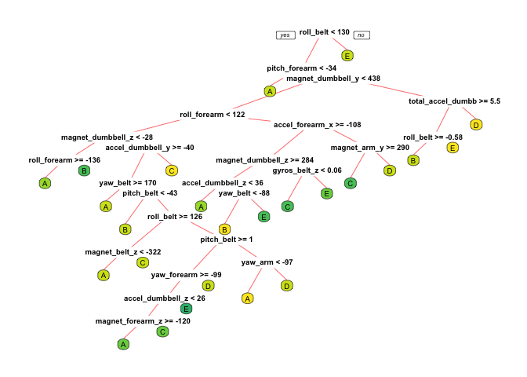

## Prediction Assignment

### Overview

The following project takes a closer look at the data collected by fitness and health tracking digital devices of the modern era. It tracks the body movements and of modern day tech enthusiasts and geeks to analyse their personal activities inexpensively.

Through this analysis, we make use of Machine Learning techniques primarily through the Caret package to analyse trends in the collected data.  

## Data Preprocessing  

```r
library(caret)
```

```
## Loading required package: lattice
```

```
## Loading required package: ggplot2
```

```r
library(rpart)
library(rpart.plot)
library(randomForest)
```

```
## randomForest 4.6-14
```

```
## Type rfNews() to see new features/changes/bug fixes.
```

```
## 
## Attaching package: 'randomForest'
```

```
## The following object is masked from 'package:ggplot2':
## 
##     margin
```

```r
library(corrplot)
```

```
## corrplot 0.84 loaded
```

### Download the Data

```r
trainUrl <-"https://d396qusza40orc.cloudfront.net/predmachlearn/pml-training.csv"
testUrl <- "https://d396qusza40orc.cloudfront.net/predmachlearn/pml-testing.csv"
trainFile <- "./data/pml-training.csv"
testFile  <- "./data/pml-testing.csv"
if (!file.exists("./data")) {
  dir.create("./data")
}
if (!file.exists(trainFile)) {
  download.file(trainUrl, destfile=trainFile, method="curl")
  download.file(testUrl, destfile=testFile, method="curl")
}
```

### Read the Data
After downloading the data from the data source, we can read the two csv files into two data frames.  

```r
training <- read.csv("./data/pml-training.csv")
testing <- read.csv("./data/pml-testing.csv")

dim(training)
```

```
## [1] 19622   160
```

```r
dim(testing)
```

```
## [1]  20 160
```
The training data set contains 19622 observations and 160 variables, while the testing data set contains 20 observations and 160 variables. The "classe" variable in the training set is the outcome to predict. 

### Clean the data
In this step, we will clean the data and get rid of observations with missing values as well as some meaningless variables.

```r
sum(complete.cases(training))
```

```
## [1] 406
```

First, we remove columns that contain NA missing values.

```r
training <- training[, colSums(is.na(training)) == 0] 
testing <- testing[, colSums(is.na(testing)) == 0] 
```

Next, we get rid of some columns that do not contribute much to the accelerometer measurements.

```r
classe <- training$classe
trainRemove <- grepl("^X|timestamp|window", names(training))
training <- training[, !trainRemove]
cleantr <- training[, sapply(training, is.numeric)]
cleantr$classe <- classe
testRemove <- grepl("^X|timestamp|window", names(testing))
testing <- testing[, !testRemove]
cleantst <- testing[, sapply(testing, is.numeric)]
```
Now, the cleaned training data set contains 19622 observations and 53 variables, while the testing data set contains 20 observations and 53 variables. The "classe" variable is still in the cleaned training set.

### Slice the data
Then, we can split the cleaned training set into a pure training data set (70%) and a validation data set (30%). We will use the validation data set to conduct cross validation in future steps.  

```r
set.seed(22519) # For reproducibile purpose
inTrain <- createDataPartition(cleantr$classe, p=0.70, list=F)
trainData <- cleantr[inTrain, ]
testData <- cleantr[-inTrain, ]
```

## Data Modeling
We fit the predictive model using Random Forest since it automatically selects important variables and is robust to correlated covariates & outliers in general.


```r
model <- randomForest(classe~.,data=trainData)
print(model)
```

```
## 
## Call:
##  randomForest(formula = classe ~ ., data = trainData) 
##                Type of random forest: classification
##                      Number of trees: 500
## No. of variables tried at each split: 7
## 
##         OOB estimate of  error rate: 0.5%
## Confusion matrix:
##      A    B    C    D    E  class.error
## A 3903    2    0    1    0 0.0007680492
## B   11 2643    4    0    0 0.0056433409
## C    0   12 2381    3    0 0.0062604341
## D    0    0   27 2223    2 0.0128774423
## E    0    0    2    5 2518 0.0027722772
```

Then, we estimate the performance of the model on the validation data set.  

```r
predictRf <- predict(model, testData)
confusionMatrix(testData$classe, predictRf)
```

```
## Confusion Matrix and Statistics
## 
##           Reference
## Prediction    A    B    C    D    E
##          A 1674    0    0    0    0
##          B    2 1135    2    0    0
##          C    0    1 1023    2    0
##          D    0    0   14  949    1
##          E    0    0    0    5 1077
## 
## Overall Statistics
##                                          
##                Accuracy : 0.9954         
##                  95% CI : (0.9933, 0.997)
##     No Information Rate : 0.2848         
##     P-Value [Acc > NIR] : < 2.2e-16      
##                                          
##                   Kappa : 0.9942         
##  Mcnemar's Test P-Value : NA             
## 
## Statistics by Class:
## 
##                      Class: A Class: B Class: C Class: D Class: E
## Sensitivity            0.9988   0.9991   0.9846   0.9927   0.9991
## Specificity            1.0000   0.9992   0.9994   0.9970   0.9990
## Pos Pred Value         1.0000   0.9965   0.9971   0.9844   0.9954
## Neg Pred Value         0.9995   0.9998   0.9967   0.9986   0.9998
## Prevalence             0.2848   0.1930   0.1766   0.1624   0.1832
## Detection Rate         0.2845   0.1929   0.1738   0.1613   0.1830
## Detection Prevalence   0.2845   0.1935   0.1743   0.1638   0.1839
## Balanced Accuracy      0.9994   0.9991   0.9920   0.9948   0.9990
```


```r
accuracy <- postResample(predictRf, testData$classe)
accuracy
```

```
##  Accuracy     Kappa 
## 0.9954121 0.9941966
```

```r
oose <- 1 - as.numeric(confusionMatrix(testData$classe, predictRf)$overall[1])
oose
```

```
## [1] 0.004587935
```

## Predicting for Test Data Set
Now, we apply the model to the original testing data set to find the predictions.

```r
result <- predict(model, cleantst[, -length(names(cleantst))])
result
```

```
##  1  2  3  4  5  6  7  8  9 10 11 12 13 14 15 16 17 18 19 20 
##  B  A  B  A  A  E  D  B  A  A  B  C  B  A  E  E  A  B  B  B 
## Levels: A B C D E
```

## Appendix: Decision Tree Visualization


```r
treeModel <- rpart(classe ~ ., data=trainData, method="class")
prp(treeModel, box.palette = "BlGnYl", branch.col = "Red", tweak = 1.2, legend.x = -5, legend.y = -3)
```

<!-- -->
